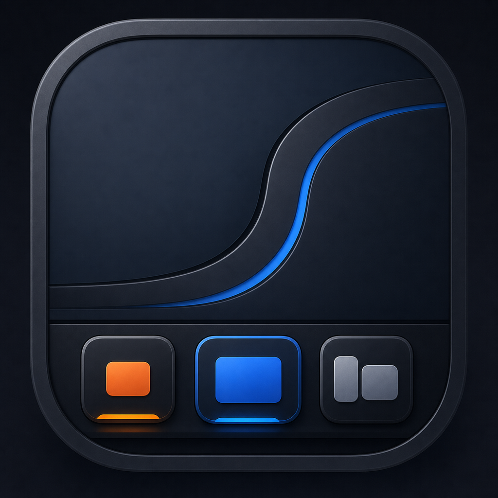

<div align="center">
  
  <h1>Taskbar S</h1>
  <p>A Windows-style taskbar for macOS, built with native AppKit and Accessibility APIs.</p>
</div>

> [!IMPORTANT]
> Taskbar S is an early release. The downloadable build is ad-hoc signed and is not yet notarized because the project does not currently have an Apple Developer ID certificate.

## What it does

Taskbar S places a native taskbar at the bottom of every connected macOS display. Each taskbar shows only the windows assigned to that display. Every accepted application window gets its own button, while windows from the same application stay together as a stable group.

### Highlights

- One taskbar button per real application window
- Stable application and window ordering
- Per-window focus highlight without raising every window from the application
- Drag-and-drop application group reordering with animated displacement
- Horizontal, taskbar-constrained dragging
- Pin and unpin applications from the context menu
- Launch pinned applications with a single click
- Relaunch pinned applications after Quit, including apps that restart without presenting a window automatically
- Orange launch indicator until the first real window appears
- Open a new window from the context menu or with middle-click
- Minimize, restore, close, and quit actions
- Per-Space taskbar contents, so macOS desktops remain independent
- Per-display taskbars that keep each monitor's windows and ordering independent
- Transient popup, tooltip, HUD, and menu filtering
- Automatic item-width compression when the taskbar fills up
- Fast horizontal insertion and removal animations
- Full-screen taskbar hiding
- Maximize and snap work-area integration that keeps automatic layouts above the taskbar while still allowing manual dragging underneath it
- Customizable panel height, item size, maximum width, padding, spacing, icon size, and animation duration
- English and Turkish interface; English is the development/default language

## Requirements

- macOS 13 Ventura or newer
- Apple Silicon or Intel Mac
- Accessibility permission
- Xcode 16 or newer only when building from source

## Install from a DMG

1. Download `Taskbar-S.dmg` from the latest GitHub release.
2. Open the DMG and drag **Taskbar S** into **Applications**.
3. Because the current build is not notarized, Control-click **Taskbar S** in Applications and choose **Open** the first time.
4. Select **Grant Access** in the taskbar.
5. In **System Settings → Privacy & Security → Accessibility**, enable **Taskbar S**.
6. Return to Taskbar S. Open and pinned windows will appear at the bottom of the display.

Taskbar S is an accessory application, so it does not show a normal Dock icon or menu-bar item. Use the grid button at the left side of the taskbar to open Settings, refresh the window list, or quit Taskbar S.

## Usage guide

### Window buttons

- **Left-click:** activate only that window.
- **Middle-click:** open a new window for the application.
- **Right-click:** go to the window, create a new window, minimize or restore it, close it, pin/unpin its application, or quit the application.
- **Drag horizontally:** reorder the complete application group.

### Pinned application buttons

- **Left-click:** launch the application.
- **Middle-click:** launch it or create a new window when already running.
- **Right-click:** open, create a new window, or unpin it.

Pinned applications remain in the taskbar after **Quit**. Clicking one starts the application again. If macOS starts the process but the application does not present a window, Taskbar S waits for it to finish launching and requests its first window automatically.

### Launch and focus indicators

- An **orange border** means an application launch is in progress.
- A **blue border** marks the focused window.
- The orange state ends when the first accepted application window appears.
- If no application process or window appears before the launch timeout, the orange state is cleared so the pinned button remains usable.

Pinned applications without an open window remain as square icon buttons.

### Displays and Spaces

- Every connected display receives its own taskbar.
- A taskbar shows only the windows assigned to that display and its currently active Space.
- Application-group order is stored independently for each display and Space.
- Changing desktops on one display does not replace the contents of another display's taskbar.
- Full-screen applications hide only the taskbar on the affected display.

### Settings

Open the grid menu and choose **Settings…**. Appearance changes are applied immediately and saved automatically. **Restore Defaults** restores the project's recommended layout.

## Build from source

```bash
git clone <your-repository-url>
cd taskbars
open Taskbar.xcodeproj
```

Select the `Taskbar` scheme and run it on your local Mac. The repository uses generic ad-hoc signing settings, so no Apple development team needs to be configured.

For a clean local build that leaves only the runnable application in `build/`:

```bash
./scripts/build-local.sh
open "build/Taskbar S.app"
```

The local build script automatically uses an available Apple Development signing identity so macOS can preserve Accessibility permission between builds. It falls back to ad-hoc signing when no development identity is installed.

To build the release DMG from Terminal:

```bash
./scripts/build-dmg.sh
```

The script creates both versioned and stable filenames in `dist/`:

```text
dist/Taskbar-S-0.2.0.dmg
dist/Taskbar-S.dmg
```

## GitHub Pages website

The static product website lives in [`docs/`](docs/). Enable GitHub Pages with **GitHub Actions** as the source; the included workflow publishes the site automatically. On GitHub Pages, the download link derives the repository owner from the Pages hostname and points to the `Taskbar-S.dmg` asset in the latest release.

## Release notes and limitations

- The app relies on macOS Accessibility APIs and private Space metadata to associate windows with desktops.
- macOS and the launched application choose a new window's initial display. Taskbar S can place the window afterward, but cannot guarantee that every third-party application draws its very first frame on the taskbar's display.
- macOS may ask for Accessibility permission again when the app identity or signature changes.
- The current public package is ad-hoc signed. A fully frictionless public release requires an Apple Developer Program membership, a Developer ID Application certificate, and notarization.
- Taskbar S does not replace or modify the macOS Dock; you may hide the Dock separately in System Settings.

## Privacy

Taskbar S runs locally. It reads window metadata required to display and activate taskbar items. It does not include analytics, advertising, accounts, or network tracking.

## License

Taskbar S is available under the [MIT License](LICENSE).
